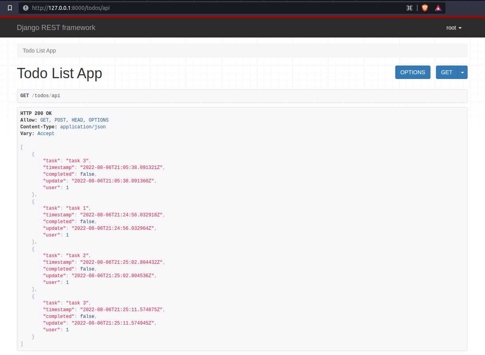
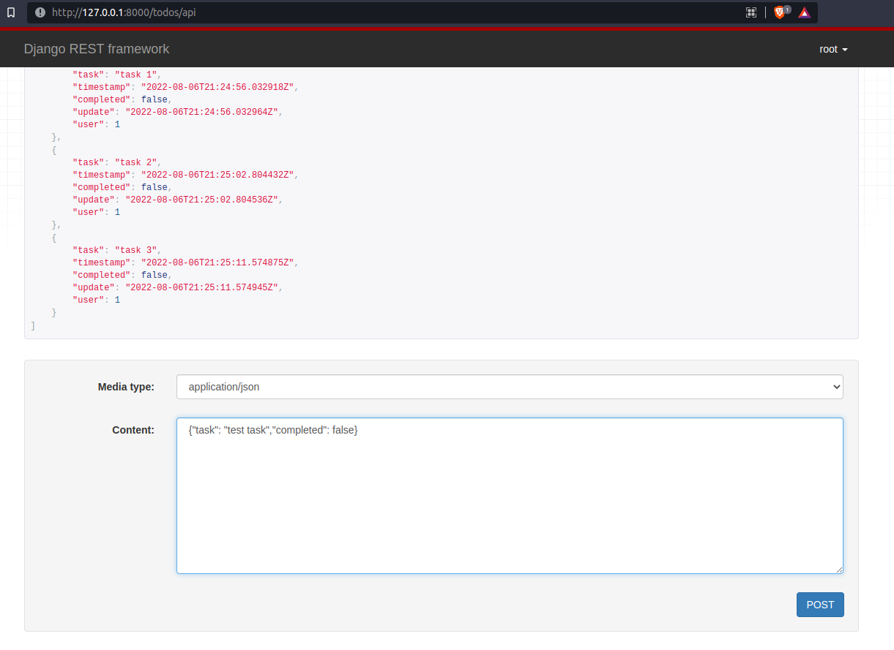

### 1 - Clone the repo
### 2 - run - `python3 manage.py migrate`
### 3 - run - `python3 manage.py runserver`

## Login User First
`id - root`  
`pass - root`

# API calls
### 1 - `http://127.0.0.1:8000/todos/api` # GET task list

### 2 - `http://127.0.0.1:8000/todos/api` # POST task

### 3 - `http://127.0.0.1:8000/todos/api/1/` # DELETE and UPDATE task

### Any helps are appreciated
